# 04 — ERD / Modelo de Dados (Fase 0)

Status: **Proposta para validação**. Fonte de verdade: `prisma/schema.prisma` (validado na Etapa 8).

## 1. Princípios

- **Tenant-scoped**: toda entidade de negócio tem `tenantId` FK obrigatório + índice composto iniciando por `tenantId`. Exceções: `Tenant`, `User`, `Role`, `Permission`, `Plan*` (plataforma).
- Deleção **lógica** (`deletedAt`) em entidades de negócio (§61). Nenhum dado clínico/financeiro é fisicamente apagado.
- Dinheiro em centavos (int); datas `timestamptz`; `timezone` no tenant.
- Auditoria: `AuditLog` é append-only (sem update/delete).
- Notificações rastreáveis fim a fim (§52): `Notification → NotificationQueue → NotificationDelivery` + `CommunicationLog` por canal.

## 2. Grupos de entidades

### Núcleo multi-tenant / RBAC

`Tenant`, `User`, `TenantUser` (user↔tenant, `role`), `Role`, `Permission`, `RolePermission`.

- `User.isSuperAdmin` é flag **global** (R10) — não é papel de tenant.
- `TenantUser` define o papel do usuário **naquele** tenant (ADMIN, PROFESSIONAL, SECRETARY) + permissões extras/overrides na própria tabela (evita explosão de papéis).

### Pacientes (dados administrativos)

`Patient` (tenantId, nome, CPF, nascimento, endereço, status, obs. administrativas), `PatientContact` (telefone, WhatsApp, e-mail, contato de emergência).

- CPF **opcional no cadastro** e armazenado com hash determinístico + últimos dígitos (LGPD minimização; busca por igualdade via hash).

### Clínico (segregado e cifrado — R4)

`ClinicalRecord` 1–1 com `Patient`; `ClinicalNote` (sessões/evoluções).

- Corpo cifrado AES-256-GCM (`contentEncrypted`); permissão `clinical:read` isolada de `patients:read`.

### Agenda / Sessões

`AppointmentSeries` (recorrência), `Appointment` (instância; status AGENDADA/CONFIRMADA/REALIZADA/CANCELADA/FALTOU/REAGENDADA; `rescheduledFromId` preserva histórico), `AvailabilitySlot`/`AvailabilityBlock` (horários e bloqueios), `WaitlistEntry` (§33).

- Unique parcial `(tenantId, professionalUserId, startsAt)` nos status ativos (R9).

### Pacotes

`Package` (nº sessões, valor, validade), `PackageSession` (consumo por `Appointment`).

### Financeiro

`AccountReceivable` (paciente, vencimento, status), `AccountPayable` (fornecedor, categoria), `Payment` (método, data, `idempotencyKey`; paga 1:N recebíveis via `PaymentAllocation`).

- `Package` referencia cobrança via `AccountReceivable` (não duplicar money path).

### Documentos / Templates

`Document` (metadados; `storageKey` R2; `Patient`/`User`/tenant; versão), `DocumentTemplate` (versionado, ativo/inativo).

### Notificações / Comunicação

`Notification` (evento), `NotificationQueue` (fila: status, `scheduledFor`, tentativas, `idempotencyKey`), `NotificationDelivery` (por canal/provider/externalId), `NotificationPreference` (por usuário/paciente e canal+categoria), `CommunicationLog` (histórico auditável), `PushSubscription` (por user+device).

### Plataforma SaaS / Sistema

`Plan`, `PlanFeature`, `Subscription`, `UsageMetric`, `Setting` (chave/valor por tenant), `AuditLog`, `Session` (refresh/sessões), `PasswordResetToken`.

## 3. Diagrama (Mermaid)

```mermaid
erDiagram
    Tenant ||--o{ TenantUser : has
    User ||--o{ TenantUser : participates
    Role ||--o{ RolePermission : grants
    Permission ||--o{ RolePermission : granted-by
    TenantUser }o--|| Role : has

    Tenant ||--o{ Patient : owns
    Patient ||--o| ClinicalRecord : has
    ClinicalRecord ||--o{ ClinicalNote : contains
    Patient ||--o{ PatientContact : has
    Patient ||--o{ Appointment : schedules
    Patient ||--o{ WaitlistEntry : joins
    AppointmentSeries ||--o{ Appointment : materializes
    Appointment |o--o| Appointment : "rescheduled-from"
    Appointment |o--o| PackageSession : consumes
    Package ||--o{ PackageSession : contains
    Package |o--|| AccountReceivable : billed-as

    Patient ||--o{ AccountReceivable : owes
    AccountReceivable ||--o{ PaymentAllocation : allocated-by
    Payment ||--o{ PaymentAllocation : allocates
    Tenant ||--o{ AccountPayable : pays
    Payment |o--o| Appointment : settles

    Tenant ||--o{ Document : owns
    Patient |o--o{ Document : about
    DocumentTemplate |o--o{ Document : generated-from
    Tenant ||--o{ DocumentTemplate : owns

    Patient ||--o{ Notification : subject
    User ||--o{ PushSubscription : subscribes
    Notification ||--o{ NotificationDelivery : delivers-via
    Notification ||--o| NotificationQueue : queued-as
    Patient ||--o{ NotificationPreference : prefers
    NotificationDelivery }o--|| CommunicationLog : logs

    Tenant ||--o{ Setting : configures
    Tenant ||--o{ AuditLog : audits
    User ||--o{ AuditLog : performs
    User ||--o{ Session : authenticates
    Tenant ||--o| Subscription : subscribes
    Plan ||--o{ Subscription : sold-as
    Plan ||--o{ PlanFeature : includes
    Subscription ||--o{ UsageMetric : measures
```

## 4. Tabela-resumo de escopo e proteção

| Entidade                                  | tenantId       | Cifrado                    | Permissão de leitura            |
| ----------------------------------------- | -------------- | -------------------------- | ------------------------------- |
| Patient / PatientContact                  | ✔              | CPF hash                   | `patients:read`                 |
| ClinicalRecord / ClinicalNote             | ✔              | **corpo AES-GCM**          | `clinical:read` (isolada)       |
| Appointment / Series                      | ✔              | —                          | `appointments:read`             |
| Package / PackageSession                  | ✔              | —                          | `packages:read`                 |
| AccountReceivable / Payable / Payment     | ✔              | —                          | `finance:read`                  |
| Document                                  | ✔              | binário no R2 privado      | `documents:read` + URL assinada |
| Notification* / CommunicationLog          | ✔              | templates sem dado clínico | `notifications:read`            |
| Setting                                   | ✔              | valores sensíveis cifrados | `settings:read`                 |
| AuditLog                                  | ✔              | —                          | `audit:read`                    |
| Tenant / User / Role / Permission / Plan* | ✖ (plataforma) | —                          | própria/admin                   |

## 5. Migrations iniciais (Etapa 8)

Sequência atômica e reversível, tudo via `prisma migrate dev`:

1. `init_core` — enums, `Tenant`, `User`, `TenantUser`, `Role`, `Permission`, `RolePermission`, `Session`, `PasswordResetToken`, `Setting`
2. `init_patients` — `Patient`, `PatientContact`
3. `init_appointments` — `AvailabilitySlot`, `AvailabilityBlock`, `AppointmentSeries`, `Appointment` (**+ unique parcial SQL crua**), `WaitlistEntry`
4. `init_clinical` — `ClinicalRecord`, `ClinicalNote` (colunas cifradas)
5. `init_packages_finance` — `Package`, `PackageSession`, `AccountReceivable`, `AccountPayable`, `Payment`, `PaymentAllocation`
6. `init_documents` — `DocumentTemplate`, `Document`
7. `init_notifications` — `Notification`, `NotificationQueue`, `NotificationDelivery`, `NotificationPreference`, `CommunicationLog`, `PushSubscription`
8. `init_saas` — `Plan`, `PlanFeature`, `Subscription`, `UsageMetric`, `AuditLog`

Migrations 2–8 podem nascer consolidadas (1 migration por grupo é o mínimo razoável). Comandos: `db:generate`, `db:migrate`, `db:seed`, `db:reset` (**reset só local**, guardado por `NODE_ENV`).

## 6. Seed inicial (desenvolvimento)

- 1 tenant demo, 1 usuário ADMIN, 1 PROFESSIONAL, 1 SECRETARY, papéis e permissões padrão, 10 pacientes sintéticos, agenda de exemplo, planos Free/Basic/Professional/Business/Enterprise.
